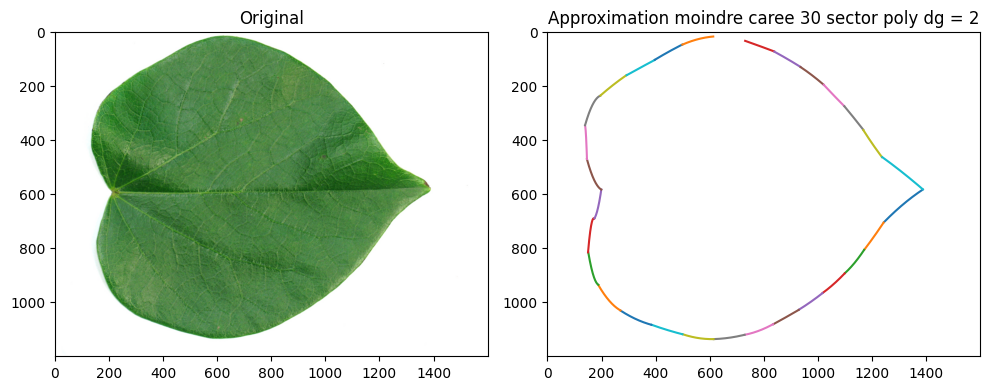
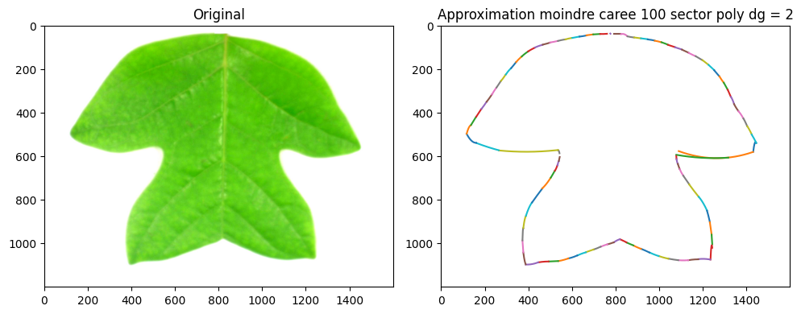
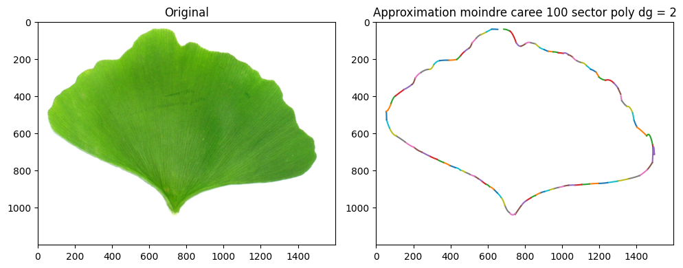

Interpolate and Approximate contour of objects with polynomes using **Newton Interpolation Method** and Approximation using **the Method of Least Squares** \
For the steps see : [sumarry](./Sumarry.pdf)

